# Keeler's 15 Elementary Plot Combinations
## Case-I
### Graph
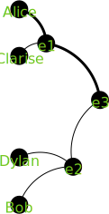
### Prompt
Clarise takes some action which compels Alice to go to a particular location.
Dylan takes some action which compels Bob to be in the same location.
Describe Clarise's action. Describe Dylan's action. Describe Alice going to that location. Describe how Alice interacts with Bob at the location.
### Chat GPT 3.5 response
## Case-II
### Graph
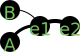
### Prompt
Alice and Bob have an interaction. Later, because of this interaction, Alice does something to Bob. Describe the first interaction. Describe the second interaction.
### Chat GPT 3.5 response
## Case-III
### Graph

### Prompt
Alice and Bob have an interaction. Later, because of this interaction, Alice does something to Bob. Still later, a third event occurs between Alice and Bob as a result of this second event. Describe the first interaction. Describe the second interaction. Describe the third interaction
### Chat GPT 3.5 response
## Case-IV
### Graph

### Prompt

### Chat GPT 3.5 response
## Case-V
### Graph
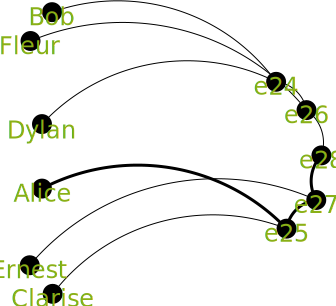
### Prompt

### Chat GPT 3.5 response
## Case-VI
### Graph
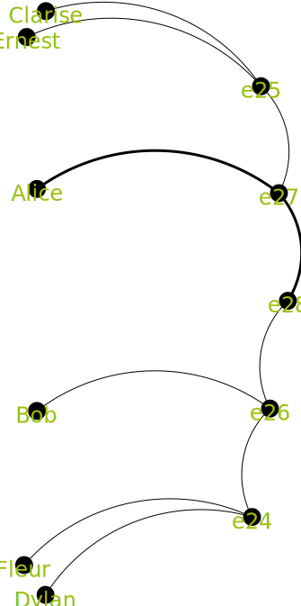
### Prompt

### Chat GPT 3.5 response
## Case-VII
### Graph
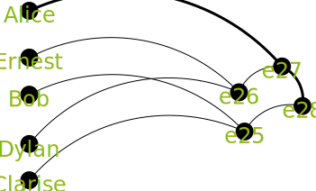
### Prompt

### Chat GPT 3.5 response
## Case-VIII
### Graph
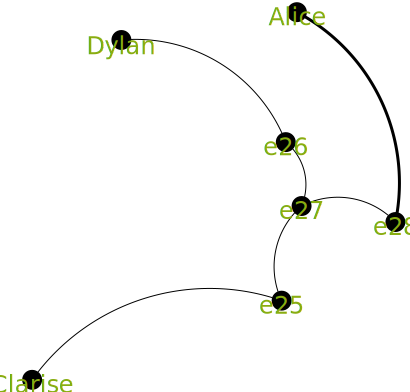
### Prompt

### Chat GPT 3.5 response
## Case-IX
### Graph
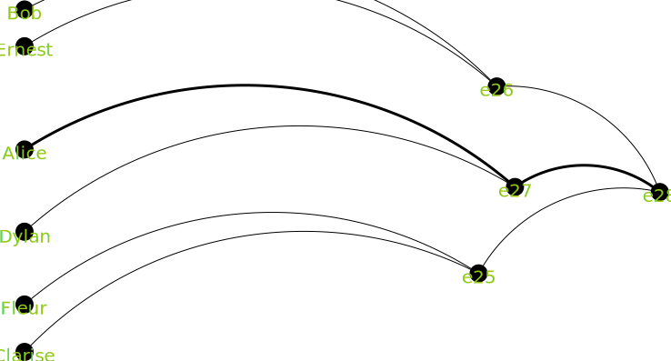
### Prompt

### Chat GPT 3.5 response
## Case-X
### Graph
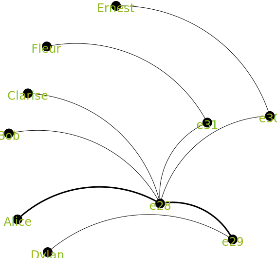
### Prompt

### Chat GPT 3.5 response
## Case-XI
### Graph
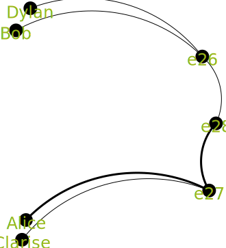
### Prompt

### Chat GPT 3.5 response
## Case-XII
### Graph
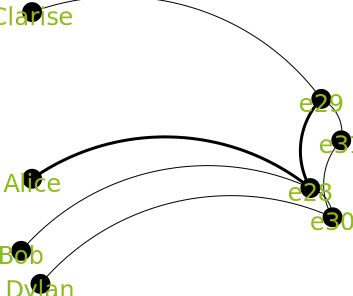
### Prompt

### Chat GPT 3.5 response
## Case-XIII
### Graph
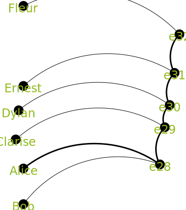
### Prompt

### Chat GPT 3.5 response
## Case-XIV
### Graph

### Prompt

### Chat GPT 3.5 response

