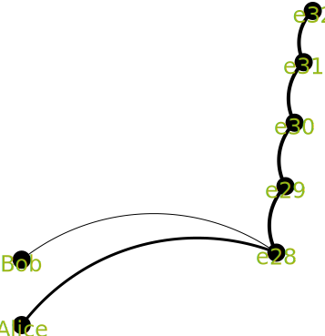

# Keeler's 15 Elementary Plot Combinations
## Case-I
### Graph

### Prompt

A, e1, 3.0
C, e1, 1.0
B, e2, 1.0
D, e2, 1.0
e1, e3, 3.0
e2, e3, 1.0 Generate a narrative describing each of the events and encounters of the characters in the sequence they are described. Pay attention to how past events motivate later events as suggested by the prompt.
### Chat GPT 3.5 response
Sure, let's create a scenario based on your description:

**Clarise's Action:**
Clarise, a close friend of Alice, sends her a mysterious letter. In the letter, Clarise writes about a hidden treasure that she claims to have discovered in an old, abandoned mansion on the outskirts of town. She tells Alice that she needs her help to uncover this treasure, hinting at an adventure of a lifetime.

**Dylan's Action:**
Dylan, who is Bob's coworker, tells him about a rare and valuable book that he's come across during his research at a local library. He shares some intriguing details about the book's contents and mentions that it's said to be located in the same old mansion that Clarise mentioned in her letter to Alice.

**Alice Going to the Location:**
Intrigued by the mysterious letter from Clarise and the information about the valuable book that Dylan shared, Alice decides to investigate further. She discusses the letter with Bob, who becomes equally curious about the potential treasure and the rare book. They agree to meet up and visit the mansion to uncover the truth behind these intriguing stories.

**Alice and Bob's Interaction at the Location:**
Alice and Bob arrive at the old, eerie mansion together. They cautiously explore its dark and mysterious rooms, searching for any clues related to the hidden treasure and the rare book. As they navigate the mansion's dusty corridors, their shared adventure draws them closer. They work together to solve puzzles, decipher riddles, and uncover secrets within the mansion.

During their exploration, Alice and Bob share stories, laughter, and even a few moments of fear as they uncover unexpected surprises within the mansion. Their bond deepens as they collaborate in this thrilling adventure, forging a unique connection that goes beyond the initial reason they came to the location. Whether they find the treasure and the rare book or not, the experience of exploring the mansion together creates a memorable and meaningful connection between Alice and Bob.

#### Commentary
* The AI has let Alice and Bob meet too early, they interact _before_ they go to the mansion, which seems to diminish the chance / surprise of them meeting at the mansion. This version implies that Alice and Bob are already sharing everything that happens with each other, or that A, B, C, and D are all effectively in the same sphere -- it diminishes the "coming together" that the plot threads are supposed to represent.
* The content is remarkably similar to Keeler's example, down to an old book being involved...
* The AI has introduced motivating objects that might very well have been represented by a plot line by Keeler. It's possibly my fault that I haven't created a possible distinction between people and objects yet. In Keeler's case-I example, one of the letters and plot lines _was_ the book (a Vindelinus).
* The AI's ending for Alice and Bob seems very much the same as the case-II cafe scenario ... are all chat GPT endinging this saccharine, or are the two scenarios simplying bleeding together because they exist in the same session?
* Word count (excuding headings and framing chat): 301 words.
## Case-II
### Graph

### Prompt

A, e1, 3.0
B, e1, 1.0
e1, e2, 3.0
e1, e2, 1.0 Generate a narrative describing each of the events and encounters of the characters in the sequence they are described. Pay attention to how past events motivate later events as suggested by the prompt.
### Chat GPT 3.5 response
**First Interaction:**
Alice and Bob meet at a coffee shop and strike up a conversation. They talk about their interests, share some laughs, and exchange contact information. They both find the conversation enjoyable and friendly.

The second interaction, where Alice does something to Bob, can take various forms depending on the context and their relationship. Here's one possible scenario:

**Second Interaction:**
A few days after their initial meeting, Alice invites Bob to an art exhibition she's organizing. Bob gladly accepts the invitation, as he's genuinely interested in art. At the exhibition, Bob is surprised to find a beautiful painting on display, and he discovers that Alice is the artist behind it. This revelation brings them closer, and they spend the evening talking about art, their passions, and their shared interests. As the night progresses, Alice offers to give the painting to Bob as a gesture of their growing connection. Bob is touched by her generosity and is grateful for the meaningful gift. This second interaction strengthens their bond and leads to a deeper connection between Alice and Bob.
## Case-III
### Graph

### Prompt

A, e1, 3.0
B, e1, 1.0
e1, e2, 3.0
e1, e2, 1.0
e2, e3, 1.0
e2, e3, 3.0 Generate a narrative describing each of the events and encounters of the characters in the sequence they are described. Pay attention to how past events motivate later events as suggested by the prompt.
### Chat GPT 3.5 response
## Case-IV
### Graph

### Prompt
 Bob interacts with Clarise. As a result of their previous experience, Clarise interacts with Alice. As a result of their previous experiences, Alice and Bob interact. Generate a narrative describing each of the events and encounters of the characters in the sequence they are described. Pay attention to how past events motivate later events as suggested by the prompt.
### Chat GPT 3.5 response
Certainly! Here's a narrative storyline based on the interactions between Bob, Clarise, and Alice as per your prompt:

---

#### Bob Interacts with Clarise:
Bob, a successful art curator, attended a prestigious art show where Clarise, a talented emerging artist, exhibited her latest series of paintings. Impressed by Clarise's innovative approach to art, Bob approached her after the show. He expressed admiration for her work and offered to help promote her art through his connections in the art world. Clarise, grateful for the opportunity, eagerly accepted Bob's offer.

#### Clarise Interacts with Alice:
Empowered by Bob's encouragement, Clarise delved deeper into the art community. She attended workshops and networking events to expand her artistic horizons. At one such event, Clarise crossed paths with Alice, an established photographer known for her unconventional style. Remembering Bob's advice to collaborate and explore new artistic avenues, Clarise approached Alice, expressing interest in working together on a project that blended photography and painting. Intrigued by Clarise's enthusiasm, Alice agreed to collaborate.

#### Alice and Bob's Interaction:
Alice, inspired by her collaboration with Clarise, sought to push the boundaries of her photography. She recalled meeting Bob briefly at an art conference where he had mentioned his interest in supporting innovative art projects. Alice reached out to Bob, remembering their previous conversation, and shared her recent collaboration with Clarise. She proposed the idea of a joint exhibition featuring their combined work – Clarise's paintings merged with Alice's experimental photography.

#### Culmination of Events:
Motivated by their past interactions and experiences, Bob, Clarise, and Alice came together to bring their collaborative vision to life. They curated an exhibition that seamlessly merged Clarise's vibrant paintings with Alice's captivating photographs. Bob utilized his expertise to organize the exhibition in a prestigious gallery, attracting art enthusiasts and critics alike.

As the exhibition opened its doors to the public, visitors were captivated by the innovative fusion of painting and photography. Bob, Clarise, and Alice witnessed how their past connections and shared passion for art had led them to create something extraordinary, showcasing the beauty of their collaborative efforts.

---

This narrative illustrates how Bob's initial support for Clarise led to her collaboration with Alice, which, in turn, led to the joint project between Alice and Bob, culminating in a groundbreaking exhibition that highlighted their collective talents and artistic synergy.
## Case-V
### Graph

### Prompt
 Bob interacts with Dylan. Alice interacts with Clarise. As a result of their previous experience, Bob interacts with Fleur. As a result of their previous experience, Alice interacts with Ernest. As a result of their previous experiences, Bob and Alice interact. Generate a narrative describing each of the events and encounters of the characters in the sequence they are described. Pay attention to how past events motivate later events as suggested by the prompt.
### Chat GPT 3.5 response
Certainly! Here's a narrative storyline based on the interactions between Bob, Dylan, Alice, Clarise, Fleur, and Ernest as per your prompt:

---

#### Bob Interacts with Dylan:
In the heart of New Orleans' bustling music scene, Bob, a renowned music producer with an ear for talent, discovered Dylan performing at a local jazz club. Bob, drawn to Dylan's soulful voice and musical prowess, approached him after the show. Intrigued by Dylan's potential, Bob offered guidance and mentorship, seeing a promising future for the young musician. They exchanged contacts, marking the beginning of a professional relationship.

#### Alice Interacts with Clarise:
Meanwhile, in the vibrant art district of New York City, Alice, an avant-garde photographer known for her unconventional perspectives, stumbled upon Clarise's art exhibition. Enthralled by Clarise's evocative paintings, Alice engaged her in conversation, discussing the emotional depth portrayed in Clarise's artwork. They exchanged thoughts on merging photography with painting, sparking a shared vision for a collaborative project that pushed the boundaries of traditional art forms.

#### Bob Interacts with Fleur:
Bob's reputation in the music industry reached the ears of Fleur, a sophisticated patron of the arts. Intrigued by Bob's knack for discovering raw talent, Fleur sought an introduction through mutual connections. In a lavish soirée hosted in Paris, they crossed paths. Bob, known for his intuitive understanding of music, and Fleur, a connoisseur of artistic expression, found common ground discussing their appreciation for emerging artists and their potential to shape the art world.

#### Alice Interacts with Ernest:
Alice's artistic journey led her to Venice, where she stumbled upon an art symposium curated by Ernest, a renowned art historian. Fascinated by Alice's unconventional approach to photography, Ernest engaged her in a dialogue about the intersection of art and societal narratives. Their conversation revolved around pushing artistic boundaries and unveiling the unspoken stories within visual art, leaving Alice intrigued by Ernest's profound insights.

#### Bob and Alice's Interaction:
As fate would have it, Bob and Alice found themselves at an international art convention in Paris. Amidst the labyrinth of art installations and creative minds, they recognized each other from their respective encounters. Bob, intrigued by Alice's avant-garde approach, struck up a conversation about the evolving landscape of artistic collaborations. Alice, recalling Clarise's artistry and Ernest's perspectives, shared her vision for a multimedia project that merged photography, music, and historical narratives.

#### Culmination of Events:
Motivated by their past connections and shared passion for innovation, Bob and Alice forged an alliance to bring their collaborative vision to fruition. They curated a groundbreaking multimedia exhibition in Paris, blending Dylan's soulful music, Clarise's emotive paintings, Alice's visionary photography, and Ernest's historical insights.

Amidst the elegant halls of a Parisian gallery, the fusion of their artistic expressions unfolded, leaving patrons captivated by the immersive experience. Fleur, Dylan, Clarise, Alice, Bob, and Ernest stood amidst their collective creation, witnessing how their past encounters had woven a tapestry of art, music, and historical narratives, uniting diverse perspectives in a harmonious symphony of creativity.

---

This narrative showcases how the initial interactions between Bob, Dylan, Alice, Clarise, Fleur, and Ernest led to a collaborative endeavor that united their diverse artistic talents and visions into a mesmerizing multimedia exhibition in the heart of Paris.
## Case-VI
### Graph

### Prompt
 Fleur interacts with Dylan. Ernest interacts with Clarise. As a result of their previous experience, Dylan interacts with Bob. As a result of their previous experience, Clarise interacts with Alice. As a result of their previous experiences, Bob and Alice interact. Generate a narrative describing each of the events and encounters of the characters in the sequence they are described. Pay attention to how past events motivate later events as suggested by the prompt.
### Chat GPT 3.5 response
Certainly! Here's a narrative storyline based on the interactions between Fleur, Dylan, Ernest, Clarise, Bob, and Alice as per your prompt:

---

#### Fleur Interacts with Dylan:
Fleur, an elegant socialite known for her philanthropy in the arts, hosted a soirée in a grand mansion nestled on the outskirts of Paris. At her gathering, she introduced Dylan, a talented young musician whose soulful melodies enchanted the guests. Fleur, drawn to Dylan's musical prowess, engaged him in conversation, expressing her admiration for his artistry. They bonded over their shared passion for creativity and exchanged contacts before the evening drew to a close.

#### Ernest Interacts with Clarise:
Meanwhile, in the vibrant art scene of Montmartre, Ernest, a seasoned art collector, stumbled upon Clarise's atelier showcasing her captivating paintings. Mesmerized by the depth in her artwork, Ernest struck up a conversation with Clarise, discussing the stories hidden within her brushstrokes. Impressed by Clarise's talent, Ernest expressed interest in promoting her art through his network of art connoisseurs, leaving Clarise both intrigued and curious about the opportunities that lay ahead.

#### Dylan Interacts with Bob:
A few weeks later, Dylan found himself performing at an intimate gathering organized by Bob, a distinguished art dealer known for his discerning eye. Impressed by Dylan's musical finesse and remembering Fleur's introduction, Bob struck up a conversation with Dylan after the performance. Dylan, inspired by Bob's knowledge of the arts, discussed his aspirations beyond music, intrigued by the possibility of exploring creative collaborations beyond his musical realm.

#### Clarise Interacts with Alice:
Encouraged by Ernest's interest in her artwork, Clarise sought new horizons for artistic expression. At a vernissage showcasing avant-garde photography, she encountered Alice, a visionary photographer known for her boundary-pushing captures. Clarise, emboldened by her previous encounter with Ernest, approached Alice, discussing the fusion of painting and photography. Alice, intrigued by Clarise's innovative ideas, saw an opportunity to explore uncharted artistic territories together.

#### Bob and Alice's Interaction:
In the labyrinthine streets of Paris, Bob and Alice found themselves drawn to a clandestine art salon known for its unconventional exhibitions. Bob recognized Alice's distinct photographic style from their previous encounters and struck up a conversation, discussing their mutual fascination for merging different art forms. Alice, recalling Clarise's proposition, shared her recent collaboration ideas, hoping to intertwine Bob's expertise in curation with her experimental photography.

#### Culmination of Events:
Motivated by their past encounters and shared aspirations, a serendipitous collaboration took shape. Dylan, inspired by Bob's insights, joined forces with Clarise and Alice to create an immersive art installation—a blend of music, paintings, and photography, curated by Bob himself.

In a hidden Parisian gallery, the amalgamation of their talents unfolded before an eclectic audience. Fleur, Ernest, Bob, Dylan, Clarise, and Alice witnessed their collective visions materialize into an ethereal symphony of art. The collaboration bridged their worlds, leaving patrons spellbound by the seamless fusion of their diverse artistic expressions.

---

This narrative weaves a tale of artistic connections and collaborative ventures, as each character's previous encounters spark new creative partnerships, leading to an enchanting and innovative art installation in the heart of Paris.
## Case-VII
### Graph

### Prompt
 Bob interacts with Clarise. Dylan interacts with Ernest. As a result of their previous experience, Dylan interacts with Alice. As a result of their previous experiences, Alice and Bob interact. Generate a narrative describing each of the events and encounters of the characters in the sequence they are described. Pay attention to how past events motivate later events as suggested by the prompt.
### Chat GPT 3.5 response
## Case-VIII
### Graph

### Prompt
 An event occurs involving Clarise. An event occurs involving Dylan. As a result of their previous experiences, Dylan and Clarise interact. As a result of their previous experience, Bob interacts with Alice. Generate a narrative describing each of the events and encounters of the characters in the sequence they are described. Pay attention to how past events motivate later events as suggested by the prompt.
### Chat GPT 3.5 response
Certainly! Here's a narrative storyline based on the events involving Clarise, Dylan, Bob, and Alice as per your prompt:

---

#### Event Involving Clarise:
Clarise, an aspiring artist, hosted an art exhibition showcasing her latest collection inspired by her travels. Among the attendees was Dylan, a passionate art enthusiast. He admired Clarise's work, captivated by the emotions her paintings evoked. Dylan introduced himself to Clarise, expressing his admiration for her artistic vision. They exchanged contact information and promised to stay in touch.

#### Event Involving Dylan:
A few weeks later, Dylan attended a photography workshop where he met Alice, an experienced photographer. They shared a mutual love for capturing moments in unique ways. Alice, impressed by Dylan's creativity, offered to collaborate on a photography project together. They planned to explore various landscapes and cityscapes to create a fusion of their distinctive styles.

#### Interaction Between Clarise and Dylan:
As Dylan and Alice embarked on their photography project, they visited a coastal town where Clarise happened to be showcasing her new artwork at a local gallery. Dylan recognized Clarise's name and eagerly went to the exhibition. Upon meeting again, Clarise and Dylan reminisced about their previous encounter. Clarise was curious about Dylan's current project and expressed interest in collaborating by incorporating her artwork into his photography series. Excited about the prospect, Dylan enthusiastically agreed.

#### Interaction Between Bob and Alice:
Meanwhile, Bob, an entrepreneur passionate about supporting artists, attended an art fundraiser organized by Alice's close friend. He was moved by the stories behind the artwork and decided to invest in promoting emerging artists. Bob was introduced to Alice during the event and learned about her upcoming collaboration with Dylan. Intrigued by the fusion of art forms, Bob proposed an idea to create a multimedia exhibition featuring Clarise's paintings merged with Dylan and Alice's photography.

#### Culmination of Events:
Motivated by their past experiences and newfound connections, Dylan, Clarise, Bob, and Alice came together to bring Bob's idea to life. They worked tirelessly, blending Clarise's paintings with Dylan and Alice's photography to create a breathtaking multimedia exhibition. The collaboration not only showcased their individual talents but also highlighted the power of artistic synergy.

As visitors marveled at the display, Clarise, Dylan, Bob, and Alice realized how their past encounters had led them on this collaborative journey, each person contributing their unique perspective and expertise to create something truly remarkable.

---

This narrative demonstrates how the initial interactions of Clarise and Dylan, followed by Dylan and Alice, paved the way for collaborative opportunities, leading to Bob's involvement and the eventual creation of a compelling artistic exhibition.
## Case-IX
### Graph

### Prompt
 Clarise interacts with Fleur. Bob interacts with Ernest. Alice interacts with Dylan. An interaction occurs between Alice, Bob, and Clarise. Generate a narrative describing each of the events and encounters of the characters in the sequence they are described. Pay attention to how past events motivate later events as suggested by the prompt.
### Chat GPT 3.5 response

**Initial Interactions**

1. **Bob and Ernest:**
   Bob and Ernest meet at a local coffee shop. They strike up a conversation about their shared interest in photography. Ernest, an experienced photographer, gives Bob some tips on improving his photography skills. They exchange contact information and agree to meet again to go on a photo shoot together.

2. **Alice and Dylan:**
   Alice and Dylan cross paths at a bookstore where they both happen to be browsing the same section. They discover a mutual love for science fiction literature and spend hours discussing their favorite authors and books. Intrigued by each other's insights, they decide to attend a sci-fi book club together, which Dylan is already a part of.

3. **Fleur and Clarise:**
   Fleur and Clarise, both passionate about hiking, join a local hiking group. During one of the group's excursions, they find themselves walking side by side, sharing stories of their favorite trails and outdoor experiences. They bond over their love for nature and decide to plan a weekend hiking trip together.

**Final Interaction:**

Alice, Bob, and Clarise find themselves at a community event focused on the arts and culture. The event features a photography exhibition, a sci-fi literature discussion panel, and a presentation on outdoor adventures. Each of our three characters attends the event, drawn by their individual interests.

1. **Bob and Alice:**
   Bob, with his newfound knowledge from Ernest, is showcasing some of his photographs at the exhibition. Alice, having seen the event details online, attends out of curiosity. She is captivated by Bob's photos and strikes up a conversation with him about his work and the stories behind the images.

2. **Alice and Clarise:**
   While discussing photography, Alice mentions her interest in outdoor activities. Clarise, who is attending the event after her recent hiking trip with Fleur, overhears the conversation. Intrigued, she joins the discussion, sharing her own experiences and suggesting some picturesque locations for Bob to capture.

3. **Bob, Alice, and Clarise:**
   As the three continue chatting, they realize the interconnectedness of their interests. Bob, who enjoys outdoor photography, finds common ground with Clarise's hiking experiences. Alice, with her passion for sci-fi literature, discovers that Clarise also has an interest in reading, creating another layer of connection. The trio decides to combine their interests, planning a weekend excursion that includes a photography session, a sci-fi book discussion, and a nature hike. This final interaction brings Bob, Alice, and Clarise together in a unique and unexpected friendship forged through their diverse interests.

#### Commentary
... It has done a good job coming up with a some story given really no input context. I'll probably need to add _something_ to set a scene or provide some specifc motivations. Keeler's more complex plot tend to involve passive characters, or "objects" in some of the roles which makes things more varied, and will be less about chat GPT's desires to see everyone come together at coffee shops and share interests.
## Case-X
### Graph

### Prompt
 An interaction occurs between Alice, Bob, and Clarise. As a result of their previous experience, Alice interacts with Dylan. As a result of their previous experience, Bob interacts with Ernest. As a result of their previous experience, Clarise interacts with Fleur. Generate a narrative describing each of the events and encounters of the characters in the sequence they are described. Pay attention to how past events motivate later events as suggested by the prompt.
### Chat GPT 3.5 response
## Case-XI
### Graph

### Prompt
 Dylan interacts with Bob. Clarise interacts with Alice. As a result of their previous experiences, Alice and Bob interact. Generate a narrative describing each of the events and encounters of the characters in the sequence they are described. Pay attention to how past events motivate later events as suggested by the prompt.
### Chat GPT 3.5 response
## Case-XII
### Graph

### Prompt
 Alice interacts with Bob. As a result of their previous experience, Alice interacts with Clarise. As a result of their previous experience, Bob interacts with Dylan. As a result of their previous experiences, Clarise and Dylan interact. Generate a narrative describing each of the events and encounters of the characters in the sequence they are described. Pay attention to how past events motivate later events as suggested by the prompt.
### Chat GPT 3.5 response
## Case-XIII
### Graph

### Prompt
 Alice interacts with Bob. As a result of their previous experience, Alice interacts with Clarise. As a result of their previous experience, Alice interacts with Dylan. As a result of their previous experience, Alice interacts with Ernest. As a result of their previous experience, Alice interacts with Fleur. Generate a narrative describing each of the events and encounters of the characters in the sequence they are described. Pay attention to how past events motivate later events as suggested by the prompt.
### Chat GPT 3.5 response
## Case-XIV
### Graph

### Prompt
 Alice interacts with Bob. As a result of their previous experience, Alice and Bob interact again. As a result of their previous experience, Alice and Bob interact again. As a result of their previous experience, Alice and Bob interact again. As a result of their previous experience, Alice and Bob interact again. Generate a narrative describing each of the events and encounters of the characters in the sequence they are described. Pay attention to how past events motivate later events as suggested by the prompt.
### Chat GPT 3.5 response

