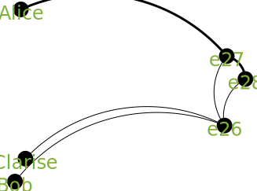

# Keeler's 15 Elementary Plot Combinations
## Case-I
### Graph

### Prompt

A, e1, 3.0
C, e1, 1.0
B, e2, 1.0
D, e2, 1.0
e1, e3, 3.0
e2, e3, 1.0
### Chat GPT 3.5 response
## Case-II
### Graph

### Prompt

A, e1, 3.0
B, e1, 1.0
e1, e2, 3.0
e1, e2, 1.0
### Chat GPT 3.5 response
## Case-III
### Graph

### Prompt

A, e1, 3.0
B, e1, 1.0
e1, e2, 3.0
e1, e2, 1.0
e2, e3, 1.0
e2, e3, 3.0
### Chat GPT 3.5 response
## Case-IV
### Graph

### Prompt
 Bob interacts with Clarise. As a result of their previous experience, Clarise interacts with Alice. As a result of their previous experiences, Alice and Bob interact.
### Chat GPT 3.5 response
## Case-V
### Graph

### Prompt
 Bob interacts with Dylan. Alice interacts with Clarise. As a result of their previous experience, Bob interacts with Fleur. As a result of their previous experience, Alice interacts with Ernest. As a result of their previous experiences, Bob and Alice interact.
### Chat GPT 3.5 response
## Case-VI
### Graph

### Prompt
 Fleur interacts with Dylan. Ernest interacts with Clarise. As a result of their previous experience, Dylan interacts with Bob. As a result of their previous experience, Clarise interacts with Alice. As a result of their previous experiences, Bob and Alice interact.
### Chat GPT 3.5 response
## Case-VII
### Graph

### Prompt
 Bob interacts with Clarise. Dylan interacts with Ernest. As a result of their previous experience, Dylan interacts with Alice. As a result of their previous experiences, Alice and Bob interact.
### Chat GPT 3.5 response
## Case-VIII
### Graph

### Prompt
 An event occurs involving Clarise. An event occurs involving Dylan. As a result of their previous experiences, Dylan and Clarise interact. As a result of their previous experience, Bob interacts with Alice.
### Chat GPT 3.5 response
## Case-IX
### Graph

### Prompt
 Clarise interacts with Fleur. Bob interacts with Ernest. Alice interacts with Dylan. An interaction occurs between Alice, Bob, and Clarise.
### Chat GPT 3.5 response
## Case-X
### Graph

### Prompt
 An interaction occurs between Alice, Bob, and Clarise. As a result of their previous experience, Alice interacts with Dylan. As a result of their previous experience, Bob interacts with Ernest. As a result of their previous experience, Clarise interacts with Fleur.
### Chat GPT 3.5 response
## Case-XI
### Graph

### Prompt
 Dylan interacts with Bob. Clarise interacts with Alice. As a result of their previous experiences, Alice and Bob interact.
### Chat GPT 3.5 response
## Case-XII
### Graph

### Prompt
 Alice interacts with Bob. As a result of their previous experience, Alice interacts with Clarise. As a result of their previous experience, Bob interacts with Dylan. As a result of their previous experiences, Clarise and Dylan interact.
### Chat GPT 3.5 response
## Case-XIII
### Graph

### Prompt
 Alice interacts with Bob. As a result of their previous experience, Alice interacts with Clarise. As a result of their previous experience, Alice interacts with Dylan. As a result of their previous experience, Alice interacts with Ernest. As a result of their previous experience, Alice interacts with Fleur.
### Chat GPT 3.5 response
## Case-XIV
### Graph

### Prompt
 Alice interacts with Bob. As a result of their previous experience, Alice and Bob interact again. As a result of their previous experience, Alice and Bob interact again. As a result of their previous experience, Alice and Bob interact again. As a result of their previous experience, Alice and Bob interact again.
### Chat GPT 3.5 response

